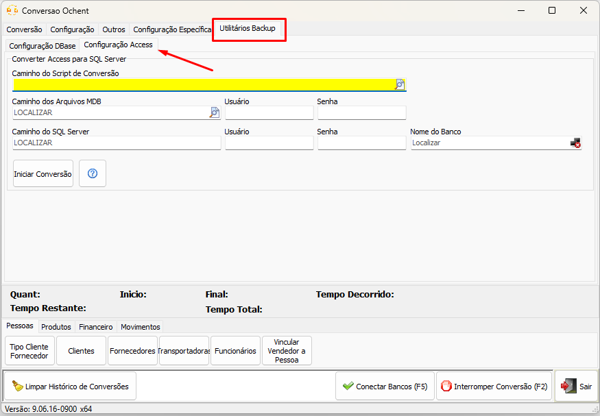
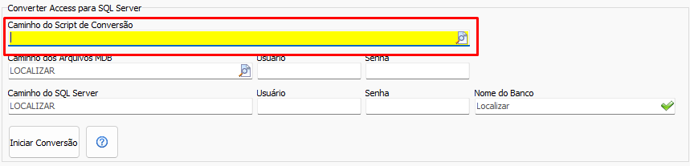
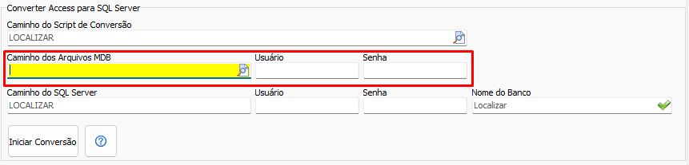
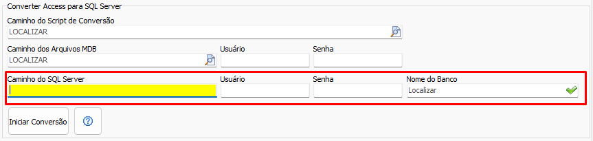

## Backup Access
Alguns sistemas utilizam o [Microsoft Access](https://www.microsoft.com/microsoft-365/access) como banco de dados. O motor SQL do Access é muito limitado, e o nosso programa de conversão aceita apenas duas fontes de origem — enquanto um sistema Access geralmente está fragmentado em vários arquivos .mdb. Sendo assim um processo de conversão de **Access** para **SQL Server** pode ser realizado através da aba [Utilitários Backup](UtilitariosBackup.md) na sessão **Configurações Access**.

### Instalando o utilitário de conversão Access

[Clique aqui](utils/conversor_access_mssql.zip) para baixar o pacote `.zip` e anote o caminho em que o arquivo foi salvo. **Não é necessário extrair o `.zip`** — ele será apenas selecionado depois no app de conversão.

### Convertendo Access para SQL Server

#### Passo 1: Selecione o pacote de conversão `.zip` no formulário

No campo **Caminho do Script de Conversão**, aponte o arquivo `.zip` baixado anteriormente. Não é preciso extraí-lo — o próprio app cuida disso.

#### Passo 2: Aponte os arquivos MDB de origem

No campo **Caminho dos Arquivos MDB**, aponte a pasta com os arquivos `.mdb` do sistema. Caso os arquivos estejam protegidos, preencha os campos **Usuário** e **Senha** correspondentes; do contrário, deixe-os em branco.

#### Passo 3: Configure o SQL Server de destino

Preencha o campo **Caminho do SQL Server** no formato `ip,porta` (ex.: `192.168.0.10,1433`), junto dos respectivos **Usuário** e **Senha**. Em **Nome do Banco**, informe o nome da base de destino — se ela já existir, a conversão se conecta a ela; se não existir, é criada automaticamente com o nome preenchido. Assim que a conexão é estabelecida, esse banco também é conectado automaticamente como banco de origem na aba `Conversão`.

#### Passo 4: Iniciar a conversão para SQL
Clique no botão `Iniciar Conversão` 

Ao fim do processo, o banco SQL Server com os dados do sistema estará pronto e já conectado como origem na aba `Conversão`. A partir disso, basta seguir o fluxo normal de conversão.