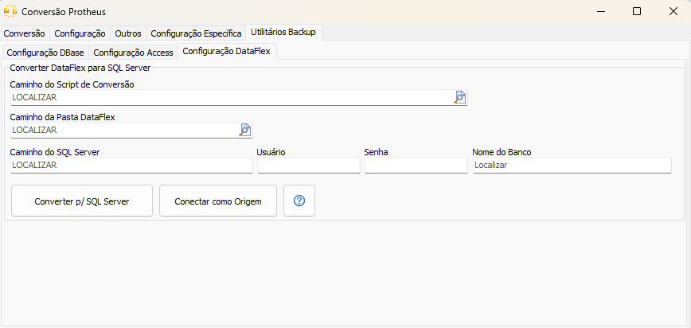
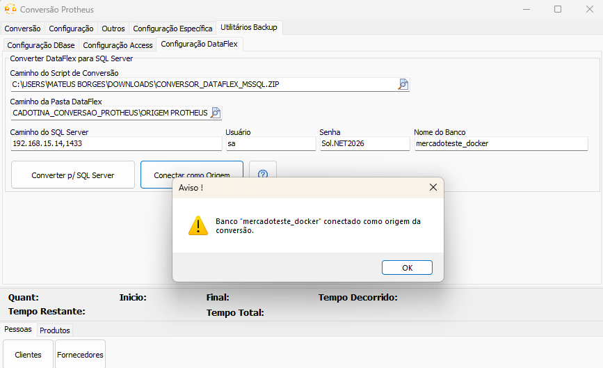
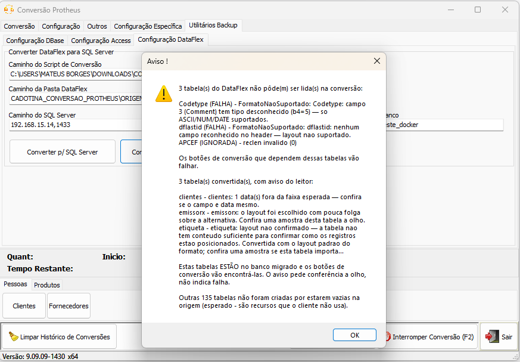

## Backup DataFlex
Alguns sistemas antigos guardam os dados em arquivos do **DataFlex**, um banco em arquivos soltos (`.dat`) que não aceita consulta por SQL. Como o programa de conversão precisa de uma origem que responda SQL, a base DataFlex é primeiro copiada para um **SQL Server**, e é esse SQL Server que a conversão usa como origem. O processo é feito pela aba [Utilitários Backup](UtilitariosBackup.md), na sessão **Configuração DataFlex**.

Diferente do [Backup Access](BackUpAccess.md), aqui **não existem usuário e senha da origem**: os arquivos do DataFlex são lidos diretamente do disco.

### Instalando o utilitário de conversão DataFlex

[Clique aqui](utils/conversor_dataflex_mssql.zip) para baixar o pacote `.zip` e anote o caminho em que o arquivo foi salvo. **Não é necessário extrair o `.zip`** — ele será apenas selecionado depois no app de conversão.

### Convertendo DataFlex para SQL Server

#### Passo 1: Selecione o pacote de conversão `.zip` no formulário

No campo **Caminho do Script de Conversão**, aponte o arquivo `.zip` baixado anteriormente. Não é preciso extraí-lo — o próprio app cuida disso.

#### Passo 2: Aponte a pasta do DataFlex

No campo **Caminho da Pasta DataFlex**, aponte a pasta do sistema antigo. Escolha a pasta que **contém** as subpastas `Data` e `DDSrc` — e não uma delas. A `Data` guarda os dados e a `DDSrc` os nomes dos campos; as duas são necessárias.

#### Passo 3: Configure o SQL Server de destino

Preencha o campo **Caminho do SQL Server** no formato `ip,porta` (ex.: `192.168.0.10,1433`), junto dos respectivos **Usuário** e **Senha**. Se **deixar usuário e senha em branco**, a conexão usa o login do Windows da própria máquina.

Em **Nome do Banco**, informe o nome da base de destino. Se ela não existir, é criada automaticamente; se existir, os dados são regravados nela.

> **Prefira um banco novo a cada conversão.** Reaproveitar um banco de uma conversão anterior pode deixar para trás tabelas que não existem mais na origem.

#### Passo 4: Converta para o SQL Server

Clique no botão `Converter p/ SQL Server`.

O Windows vai pedir confirmação de administrador — isso é esperado, porque na primeira execução o pacote instala o que precisa para rodar. Em seguida abre uma janela preta (PowerShell) que acompanha a conversão tabela por tabela. **Deixe essa janela aberta até o fim**; ela avisa quando termina e só fecha quando você mandar.

O tempo depende do tamanho da base — em uma base de mercado com cerca de 95 mil produtos, leva por volta de 5 minutos.

Se clicar no botão de novo enquanto a conversão está rodando, o app avisa que já existe uma em andamento e não inicia outra. **Espere terminar**: duas conversões ao mesmo tempo atrapalham uma à outra.

#### Passo 5: Conecte o banco convertido como origem

Quando a janela avisar que terminou, clique em `Conectar como Origem`. O app conecta o banco recém-criado e preenche sozinho os campos de origem da aba `Conversão`.

A ordem importa: **primeiro converta, depois conecte**. Se clicar em `Conectar como Origem` antes de converter, o banco é criado vazio e a conexão dá certo — mas não há dado nenhum lá dentro.

### Entendendo o aviso do fim da conversão

Ao conectar, o app mostra um resumo do que aconteceu. Ele separa três situações, que têm consequências bem diferentes:

**Tabelas que não puderam ser lidas.** Ficaram de fora do banco convertido. Os botões de conversão que dependem delas vão falhar. É o único bloco que exige providência: avise o suporte informando os nomes que aparecem ali.

**Tabelas com soma diferente entre origem e destino.** As linhas foram gravadas, mas algum valor mudou no caminho. **Não use essa conversão sem falar com o suporte.**

**Tabelas convertidas, com aviso.** Estas **estão** no banco convertido e os botões de conversão vão encontrá-las normalmente. O aviso apenas pede que você confira alguns registros dessas tabelas na tela do sistema antigo, comparando com o que foi convertido. Não é falha.

Por último, o aviso informa quantas tabelas ficaram vazias. Isso é **normal e esperado**: são recursos do sistema antigo que o cliente nunca usou, e costumam ser a maioria das tabelas.

Com o banco conectado como origem, basta seguir o fluxo normal de conversão.
