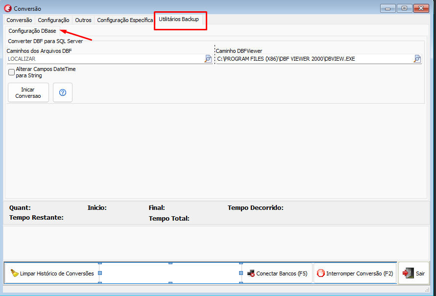
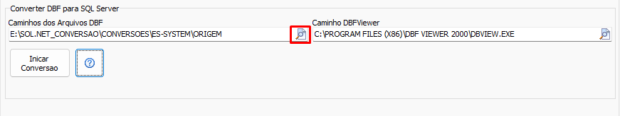
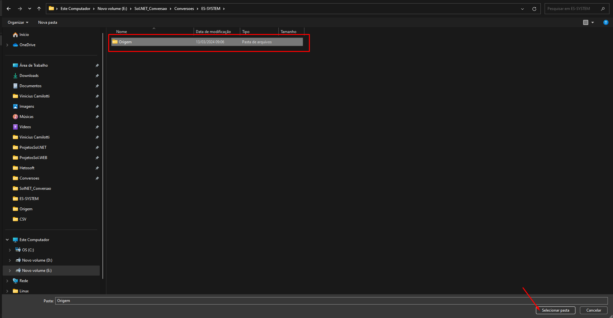
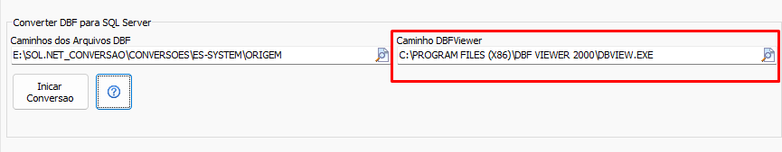

## Backup DBase
Alguns sistemas utilizam uma plataforma legado de banco de dados chamada [DBase](https://www.dbase.com/). Por ser um software proprietário e sem suporte **Não é possível conectar a bancos DBase diretamente**. Sendo assim um processo de conversão de **DBase** para **SQL Server** pode ser realizado através da aba [Utilitários Backup](UtilitariosBackup.md) na sessão **Configurações DBase**. A solução encontrada foi utilizar uma licença do Software [DBF Viewer 2000](https://www.dbf2002.com/pt/) para realizar a conversão dos arquivos .DBF para arquivos .SQL e a partir desses novos arquivos .SQL importar os dados para o SQL Server.

### Instalando e ativando o DBF Viewer

[Clique aqui](https://www.dbf2002.com/dbfview.msi) para baixar o instalador e siga o processo até o fim. Anote a pasta em que o programa foi instalada 
### Convertendo DBF para SQL Server

#### Passo 1: Criando um banco de dados SQL Server
Crie uma nova database no SQL Server através do script

```sql
CREATE DATABASE nome_cliente;
```

Ou então siga o processo de criação de base de dados do SQL Server Management Studio

#### Passo 2: Conectar-se ao banco de dados SQL Server criado na aba de `Conversão`[^1]  


[^1]: Ver [Conectarbancos](Conectarbancos.md)

#### Passo 3: Aponte as pastas com arquivos .DBF no formulário






#### Passo 4: Verificar o caminho do executável do DBF Viewer



Aponte o caminho do executável `dbfview.exe` que pode ser encontrado na pasta de instalação do DBFViewer 2000

#### Passo 5: Iniciar a conversão para SQL
Clique no botão `Iniciar Conversão` 

Ao fim do processo um novo banco SQL Server com os dados do sistema estará pronto para conversão. A partir disso basta utilizar os botões normalmente