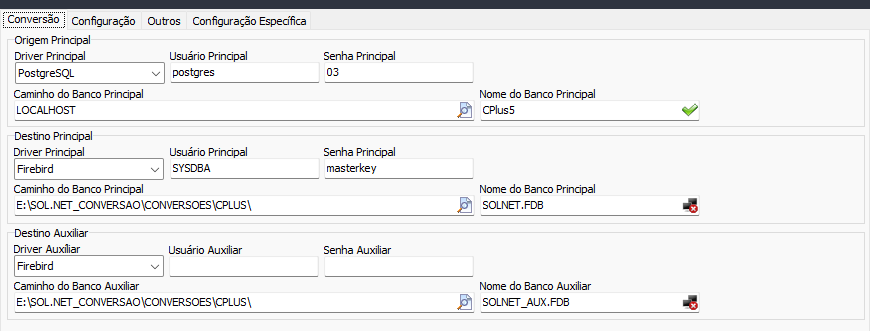
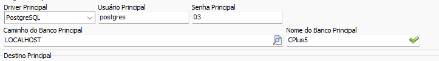
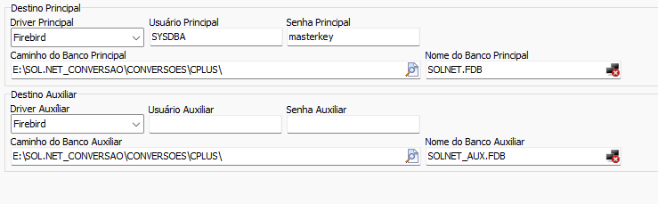

# Conectar bancos  
Aba inicial dos formulários de conversão. Conecta os bancos Origem e Destino  
  
## Conectando o banco Origem  
  
1) Selecione o tipo de banco correto em `Driver Principal`.  
2) Informe usuário e senha do banco origem  
3) Aponte para o caminho ou IP do banco origem em `Caminho do Banco Principal`  
4) Aponte para o arquivo ou nome do banco em `Nome do Banco Principal`  
## Conectando os bancos destino  
  
Selecione os bancos SOL.NET.  
