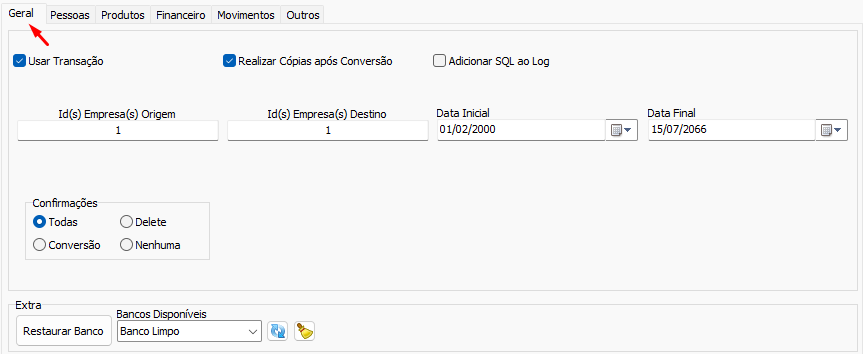

Voltar: [README](Conversao/README.md)
# Configuração Geral  
Aba de configuração geral do Conversão.  
  
É obrigatório preencher [Configuração De Empresa](ConfiguracaoDeEmpresa.md) origem e destino e para algumas conversões também é obrigatório preencher [Configuração De Data](ConfiguracaoDeData.md)  
## Configurações  
- [Configuração De Data](ConfiguracaoDeData.md)  
- [Configuração De Empresa](ConfiguracaoDeEmpresa.md)  
- [Utilizar Transação](UtilizarTransacao.md)  
- [Realizar Cópias após Conversão](RealizarCopiasaposConversao.md)  
- [Adicionar SQL ao Log](AdicionarSQLaoLog.md)  
- [Confirmações](Confirmacoes.md)