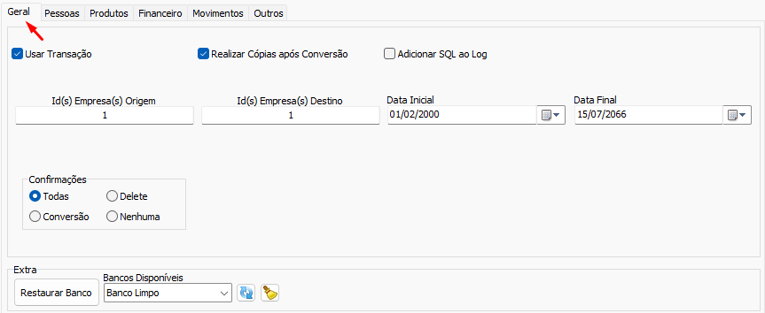

# Configuração Geral  
Aba de configuração geral do Conversão.  
  
É obrigatório preencher [Configuração de empresa](./Configura%C3%A7%C3%A3o%20de%20empresa.md) origem e destino e para algumas conversões também é obrigatório preencher [Configuração de Data](./Configura%C3%A7%C3%A3o%20de%20Data.md)  
## Configurações  
- [Configuração de Data](./Configura%C3%A7%C3%A3o%20de%20Data.md)  
- [Configuração de empresa](./Configura%C3%A7%C3%A3o%20de%20empresa.md)  
- [Utilizar Transação](./Utilizar%20Transa%C3%A7%C3%A3o.md)  
- [Realizar Cópias após Conversão](./Realizar%20C%C3%B3pias%20ap%C3%B3s%20Convers%C3%A3o.md)  
- [Adicionar SQL ao log](./Adicionar%20SQL%20ao%20log.md)  
- [Confirmações](./Confirma%C3%A7%C3%B5es.md)