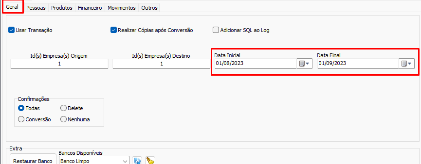

# Configuração de data inicial e final  
  
É necessário selecionar uma data inicial e final na aba `Geral` da sessão `Configurações`. As conversões de [Contas](./Contas.md) e [Movimentos](./Movimentos.md) convertem apenas registros em um dado período de tempo devido ao alto volume de registros que normalmente essas entidades possuem.  
>[!IMPORTANT]  
>Como a aplicação do `SolNet_Conversao` é uma aplicação 32bits, selecionar um intervalo de datas muito grande pode causar um erro de `out of memory`, sempre tente converter intervalos curtos, ativando os botões de conversão (`Contas`, `Contas Pagar`, `Contas Receber`, `Pedido de venda`, etc) uma vez para cada intervalo. Sendo assim é necessário persistir registros entre conversões clicando em "Não" no dialogo de deleção ou marcando as opções de [Confirmações](./Confirma%C3%A7%C3%B5es.md) `Conversão` ou `Nenhuma`.  
  
## Ver Também  
- [Contas](./Contas.md)  
- [Movimentos](./Movimentos.md)  
- [Configuração Geral](./Configura%C3%A7%C3%A3o%20Geral.md)