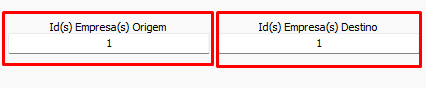

# Configuração de empresa  
Antes de iniciar uma conversão é necessário informar o "De-Para" de empresas nos campos `Id(s) Empresa(s) Origem` e `Id(s) Empresa(s) Destino`.  
  
Esses campos tem duas funções:  
1) Determinar quais empresas do banco origem devem ser convertidas  
2) Determinar para quais Empresas no destino as empresas origem devem ser convertidas  
>[!IMPORTANT]  
>Indique os Ids de empresa separados com ',' em caso de multi-empresas  
## Gerando o "De-Para"  
A ordem com que as empresas são indicadas no campos é a ordem para qual elas serão convertidas  
- Exemplo:  
      
    Nesse caso as empresas 1,2 e 6 da origem serão convertidos para as empresas 1,2 e 3 no destino  
  - **De-Para**  
  
    | De(Origem) | Para(Destino) |   
    | ---------- | ------------- |  
    | Empresa 1  | Empresa 1     |  
    | Empresa 2  | Empresa 2     |  
    | Empresa 6  | Empresa 3     |  
