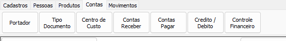
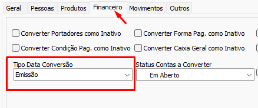
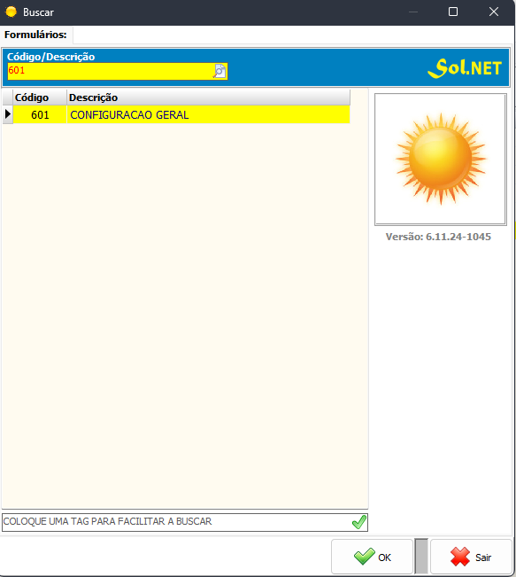
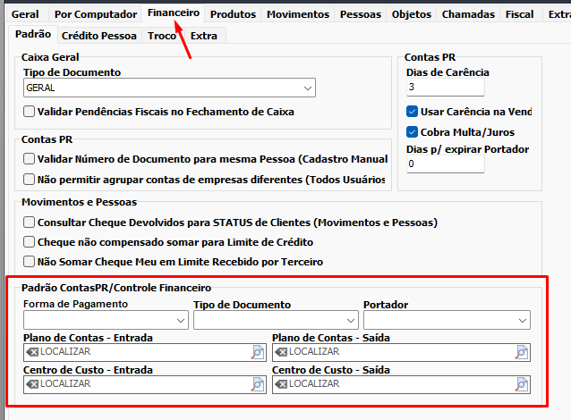
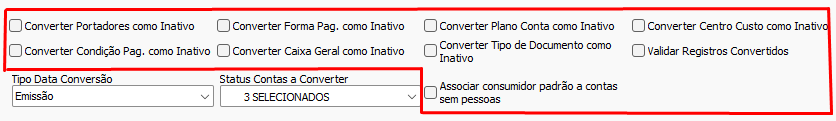

# Contas  
Converte as entidades relacionadas a Contas Pagar/Contas Receber (`CONTAS_PR`). Na aba de conversão de contas algumas configurações são obrigatórias. Além das configurações da aba `Financeiro` a [Configuração de Data](./Configura%C3%A7%C3%A3o%20de%20Data.md) é necessária assim como algumas [configurações do SOL.NET](Contas.md#Configurações%20Obrigatórias%20-%20SOL.NET). Além disso a conversão de contas possui dependência da conversão de [Pessoas](./Pessoas.md)  
  
>[!IMPORTANT]  
>Como as conversões de Contas/Contas Receber/Contas Pagar dizem respeito a mesma tabela no SOL.NET é importante clicar em "não" na [confirmação](./Confirma%C3%A7%C3%B5es.md) de deleção ou marcar a opção `Nenhum` ou `Conversão` na configuração de [confirmação](./Confirma%C3%A7%C3%B5es.md). O mesmo vale para conversões de diferentes [períodos do mesmo botão](./Configura%C3%A7%C3%A3o%20de%20Data.md)   
## Configurações Obrigatórias - Conversão  
  
### Tipo data Conversão  
  
A configuração de `Tipo Data Conversão` determina a partir de qual tipo de data a conversão deve selecionar as contas a serem convertidas. As opções são:  
- `Emissão`: Converte contas da data de emissão [inicial até a final](./Configura%C3%A7%C3%A3o%20de%20Data.md)  
- `Cadastro`: Converte contas da data de cadastro [inicial até a final](./Configura%C3%A7%C3%A3o%20de%20Data.md)  
- `Vencimento`: Converte contas da data de vencimento [inicial até a final](./Configura%C3%A7%C3%A3o%20de%20Data.md)  
Veja um exemplo a seguir:  
- Considere que a `Data inicial` selecionada é **31/12/2023** e a `Data final` selecionada é **01/01/2024** e o seguinte conjunto de dados  
  
  | ContaPR | Data Emissão | Data Cadastro | Data Vencimento |  
  | ------- | ------------ | ------------- | --------------- |  
  | 1       | 31/12/2023   | 02/01/2024    | 01/02/2024      |  
  | 2       | 30/12/2023   | 31/12/2023    | 01/01/2024      |  
  | 3       | 01/01/2023   | 01/01/2023    | 01/02/2024      |  
  
- As Conversões ocorrerão da seguinte maneira  
  
  | Contas  | Emissão        | Cadastro       | Vencimento     |  
  | ------- | -------------- | -------------- | -------------- |  
  | Conta 1 | Convertida     | Não Convertida | Não Convertida |  
  | Conta 2 | Não Convertida | Convertida     | Convertida     |  
  | Conta 3 | Convertida     | Convertida     | Não Convertida |   
	  
### Status Contas a Converter  
Seleciona o status das contas que devem ser convertidas. É necessário marcar ao menos uma das opções na caixa da seleção, mais de um status de conta pode ser selecionado  
- Valores possíveis  
    - `Em Aberto`: Converte as contas com status "em aberto"  
    - `Quitadas`: Converte as contas com status "quitado"  
    - `Vencidas`: Converte as contas com status "vencida"  
## Configurações Obrigatórias - SOL.NET  
- Antes de iniciar a conversão de contas, deve ser feita a configuração financeira do SOL.NET, já que a conversão leva em conta os valores padrões definidos no sistema  
### Configurando os parâmetros financeiros  
- Nas configurações gerais do SOl.NET abra a aba de configuração financeira  
  
  
  
- Defina  
    - Uma `Forma de Pagamento` padrão  
    - Um `Tipo de Documento` padrão  
    - Um `Plano de Contas - Entrada` padrão  
    - Um `Plano de Contas - Saída` padrão  
    - Um `Centro de Custo - Entrada` padrão  
    - Um `Centro de Custo - Saída` padrão  
  
## Configurações Opcionais - Conversão  
  
### `Converter Portadores como Inativo`  
- Converte portadores como inativo  
### `Converter Forma Pag. como Inativo`  
- Converte Formas de pagamento como inativas  
### `Converter Plano Conta como Inativo`  
- Converte Plano Conta como inativo  
### `Converter Centro Custo como Inativo`  
- Converte Centro Custo como Inativo  
### `Converter Condição Pag. como inativo`  
- Converte Condição de pagamento como inativo  
### `Converter Caixa Geral como inativo`  
- Converte caixa geral como inativo  
### `Converter Tipo de Documento como inativo`  
- Converte Tipo de Documento como inativo  
### `Validar Registros Convertidos`  
- Ao fazer a conversão valida se a conta a ser convertida já foi convertida anteriormente. Útil em situações onde é necessário reconverter os registros após a conversão oficial já ter sido feita  
### `Associar consumidor padrão a contas`  
- Em alguns sistemas, seja por diferença de estrutura ou por falta de integridade de dados, uma ou mais contas podem não estar associada a uma pessoa. É possível, nesses casos, adicionar a pessoa da conta um `Consumidor Padrão`.  
>[!NOTE]  
> Para utilizar essa essa configuração, é necesário registrar uma pessoa no SOL.NET como consumidor Padrão  
  
## Entidades Comuns  
- `Tipo Documento`  
    - Tabela: `TIPO_DOCUMENTO`  
    - Sem Dependências  
- `Centro de custo`  
    - `CENTRO_CUSTO`  
    - Sem Dependências  
- `Portadores`  
  - `PORTADOR`  
  - Sem Dependências  
- `Contas Pagar/ Contas Receber/ Contas`  
    - Tabelas: `CONTAS_PR`, `CONTAS_PR_CF`   
    - Dependências:  
        - [Pessoas](./Pessoas.md)  
        - `Centro Custo` (Pode variar)  
        - `Tipo docuemnto` (Se houver)  
        - `Portadores` (Se houver)  
- `Controle Financeiro`  
    - Tabela: `CONTROLE_FINANCEIRO`  
    - Dependências:  
        - `Contas`  
## Ver também  
- [Configuração Geral](./Configura%C3%A7%C3%A3o%20Geral.md)  
- [Configuração de Data](./Configura%C3%A7%C3%A3o%20de%20Data.md)  
- [confirmação](./Confirma%C3%A7%C3%B5es.md)  
- [Pessoas](./Pessoas.md)