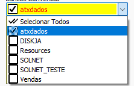

Voltar: [Conversão Especifica](ConfiguracaoEspecifica.md)
# Conversão BSX  
## Informações  
- **Banco**  
    - Tipo: SQL Server  
    - Versão Especifica: N/A  

### Abas implementadas

#### Legenda

| Ícone | Status                   |
| :-----: | ------------------------ |
| ✅    | Implementado: Completo   |
| ⚠️    | Implementado: Incompleto |
| ❌    | Não implementado         |
  
#### Implementação

| Cadastro | Pessoas | Produtos | Contas | Movimentos | Objetos |
|:--------:|:-------:|:--------:|:------:|:----------:|:-------:|
|    ✅    |   ✅    |    ✅    |   ✅   |     ✅     |   ❌    | 	

Caso necessário abrir chamada para implementação de alguma entidade
  
## Configurações iniciais  
### Bancos de dados  
Além de [conectar os bancos](Conectarbancos.md) origem e destino, na conversão do BSX é necessário selecionar na aba `Configuração BSX`, quais bancos de dados. Uma lista de todos os bancos SQL Server disponíveis na maquina estarão disponíveis na caixa de seleção e apenas os pertinentes a conversão devem ser selecionados  
  
  
### Cadastrar Consumidor Padrão  
Foi identificado que no sistema BSX podem haver diversas falhas de integridade de dados, sendo assim muitas contas podem estar associadas a pessoas deletadas ou a nenhuma pessoa. É necessário cadastrar uma pessoa como consumidor padrão no SOL.NET antes de prosseguir com os botões de [Contas](./Contas.md)  
  
### Cadastrar Forma de pagamento: Cheque  
Foi identificado que a estrutura de formas de pagamento do banco destino é incompatível com a do SOL.NET. Sendo assim é necessário cadastrar uma forma de pagamento do tipo "Cheque" antes de prosseguir com os botões de [Contas](./Contas.md)  
  
### Cadastrar Status de atendimento  
O BSX pode possuir conversões de `Chamadas`. Cadastre Status Chamada no SOL.NET antes de prosseguir com o botão `Chamadas`  
  
### Cadastrar Tipo de atendimento  
O BSX pode possuir conversões de `Chamadas`. Cadastre Tipos de atendimento no SOL.NET antes de prosseguir com o botão `Chamadas`  
## Configuração específica  
  
### Status Chamada  
Seleciona quais status de chamada devem ser convertidos  
  
### Tipo Atendimento  
Seleciona quais tipos de atendimento devem ser convertidos