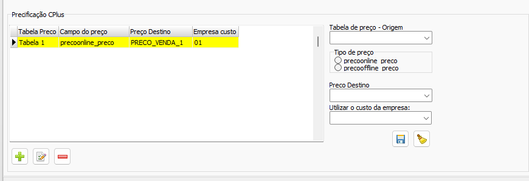
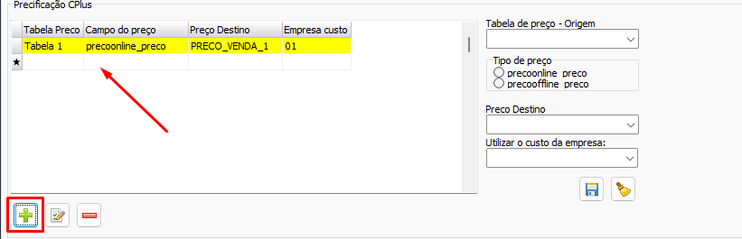
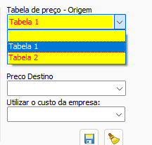
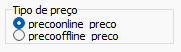
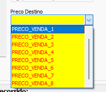
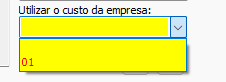
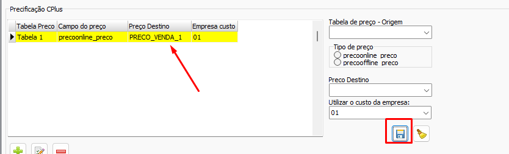

# Conversão CPlus  
## Informações  
- **Banco**  
    - Tipo: Postgres SQL  
    - Versão: Utilizar a mais recente  
## Configurações específicas  
### Precificação  
  
A precificação do CPlus funciona com Tabelas de preço por empresa, podendo conter N preços por produto através das tabelas. Além disso cada preço tem uma variação para `precoonline` e `precooffiline`  
#### Configurando a precificação  
1) Adicione uma nova configuração de preço no botão ➕  
      
2) No seletor `Tabela de preço - Origem` estarão todas as tabelas de preço disponíveis. Selecione uma  
      
3) Selecione de qual campo (`precoonline` ou `precooffline`) o preço a ser convertido deve ser selecionado  
      
4) Selecione para qual preço destino a combinação `Tabela de Preço - Origem`/`Tipo de preço` deve ser convertido  
      
5) Selecione a Empresa Origem da qual o custo deve ser associado para esse preço. Todas as empresas origem estarão disponíveis nesse seletor  
      
6) Clique no botão 💾 para salvar as alterações  
    