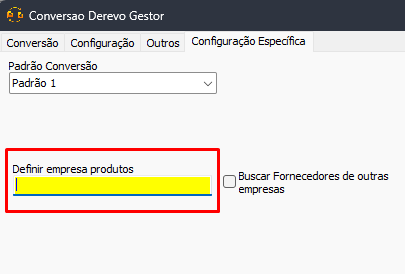
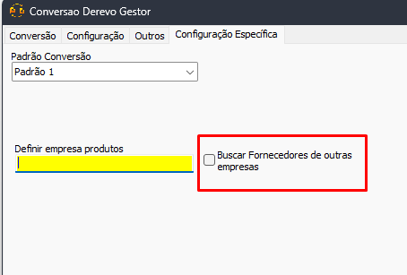

Voltar: [Conversão Especifica](ConfiguracaoEspecifica.md)
# Conversão Derevo Gestor  
## Informações  
- **Banco**  
    - Tipo: Firebird  
    - Versão Especifica: Versão 2.5  

### Abas implementadas

#### Legenda

| Ícone | Status                   |
| ----- | ------------------------ |
| ✅    | Implementado: Completo   |
| ⚠️    | Implementado: Incompleto |
| ❌    | Não implementado         |
  
#### Implementação

| Cadastro | Pessoas | Produtos | Contas | Movimentos | Objetos |
|:--------:|:-------:|:--------:|:------:|:----------:|:-------:|
|    ✅    |   ✅    |    ✅    |   ✅   |     ✅     |   ❌    |

Caso necessário abrir chamada para implementação de alguma entidade

## Configuração específica  
### Configuração de Padrão  
Foi identificado que o sistema Derevo possui versões diferentes de banco de dados. O padrão deve ser selecionado na aba de configuração especifica  

### Identificando quais padrões usar

#### Padrão 1
- Bando de dados: Firebird 2.5
- Nome usual do banco: SAD_GESTOR-xxxxxxxx.FDB
- Não possui a tabela `SM_CD_EF_NCM_TRIBUTACAO_F` 

#### Padrão 2
- Banco de dados: Firebird 2.5
- Nome usual do banco: SAD_GESTOR-xxxxxxxx.FDB
- Possui a tabela `SM_CD_EF_NCM_TRIBUTACAO_F`

#### Padrão 3
- Banco de dados: Firebird 3.0
- Nome usual do banco: DEREVO_GESTOR
- Não possui a tabela `SM_CD_EF_NCM_TRIBUTACAO_F` 

### Configurações

#### Configurações de Produtos

##### Definir Empresa produtos
- Padrões: `Pardrão 1` e `Padrão 3`

Define qual empresa (origem) deve ser selecionada para buscar os detalhes do produto  

##### Buscar Fornecedores de outras empresas
- Padrões: `Pardrão 1` e `Padrão 3`

Marque essa opção caso deseje que, se nenhum fornecedor for encontrado na empresa selecionada, o primeiro fornecedor encontrado para aquele produto seja selecionado. Esse processo deixa a conversão mais lenta

### Verifique as tabelas de botões 
- Legenda:
	- ✅ = Ok
	- ⚠️ = Incerto
	- ❌ = Não implementado

#### Pessoas

|         | Tipo 1 | Tipo 2 | Tipo 3 |
| ------- | ------ | ------ | ------ |
| Pessoas | ✅     | ✅     | ✅     | 
| Marcas  | ✅     | ✅     | ✅     |

#### Produtos

|                        | Tipo 1 | Tipo 2 | Tipo 3 |
| ---------------------- | ------ | ------ | ------ |
| Família                | ✅     | ✅     | ✅     |
| Grupo                  | ✅     | ✅     | ✅     |
| Sub Grupo              | ✅     | ✅     | ✅     |
| Unidade                | ✅     | ✅     | ✅     |
| Tributação Federal     | ✅     | ✅     | ✅     |
| NCM                    | ✅     | ✅     | ✅     |
| Produto                | ✅     | ✅     | ✅     |
| Produtos Códigos       | ✅     | ✅     | ✅     |
| Produtos Troca         | ✅     | ✅     | ⚠️     |
| Produtos Linkados      | ✅     | ✅     | ⚠️     |
| Promoção               | ✅     | ✅     | ⚠️     |
| Prod. Situação Estoque | ✅     | ✅     | ⚠️     |

#### Contas

|                | Tipo 1 | Tipo 2 | Tipo 3 |
| -------------- | ------ | ------ | ------ |
| Portadores     | ✅     | ✅     | ✅     |
| Tipo Documento | ✅     | ✅     | ✅     |
| Plano Contas   | ✅     | ✅     | ✅     |
| Contas PR      | ✅     | ✅     | ✅     |

#### Movimentos

|                        | Tipo 1 | Tipo 2 | Tipo 3 |
| ---------------------- | ------ | ------ | ------ |
| Tipo Movimentos        | ✅     | ✅     | ✅     |
| Movimento de Entrada   | ✅     | ✅     | ✅     |
| Movimento de Saída     | ✅     | ✅     | ✅     |
| Venda Pedido           | ❌     | ❌     | ✅     |
| Cupom                  | ✅     | ⚠️     | ✅     |
| Referência NFE         | ✅     | ✅     | ✅     |
| Histórico de Movimento | ✅     | ✅     | ✅     |
