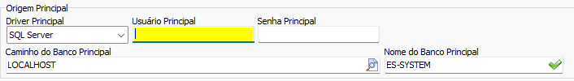

Voltar: [Conversão Especifica](ConfiguracaoEspecifica.md)
# Conversão ES-System
## Informações
- **Banco**:
	- Tipo: 
	- Versão específica:

### Abas implementadas

#### Legenda

| Ícone | Status                   |
|:-----:| ------------------------ |
|  ✅   | Implementado: Completo   |
|  ⚠️   | Implementado: Incompleto | 
|  ❌   | Não implementado         |
  
#### Implementação

| Cadastro | Pessoas | Produtos | Contas | Movimentos | Objetos |
|:--------:|:-------:|:--------:|:------:|:----------:|:-------:|
|    ❌    |   ✅    |    ✅    |   ❌   |     ❌     |   ❌    |

Caso necessário abrir chamada para implementação de alguma entidade

## Configuração específica
O Sistema ES-System utiliza banco de dados [dBASE](https://www.dbase.com/), um SGBD proprietário e pouco utilizado. **Não é possível conectar-se ao banco dBASE diretamente**. A solução encontrada foi utilizar uma licença do Software [DBF Viewer 2000](https://www.dbf2002.com/pt/) para realizar a conversão dos arquivos .DBF para arquivos .SQL e a partir desses novos arquivos .SQL importar os dados para o SQL Server. O processo de conversão DBF->SQL->SQL Server foi automatizado e pode ser encontrado na aba de configuração específica do formulário de conversão ES-System 

### Instalando e ativando o DBF Viewer

[Clique aqui](https://www.dbf2002.com/dbfview.msi) para baixar o instalador e siga o processo até o fim. Anote a pasta em que o programa foi instalada 
### Convertendo DBF para SQL Server

#### Passo 1: Criando um banco de dados SQL Server
Crie uma nova database no SQL Server através do script

```sql
CREATE DATABASE nome_cliente;
```

Ou então siga o processo de criação de base de dados do SQL Server Management Studio

#### Passo 2: Conectar-se ao banco de dados SQL Server criado na aba de `Conversão`[^1]  



[^1]: Ver [Conectarbancos](Conectarbancos.md)

#### Passo 3: Aponte as pastas com arquivos .DBF no formulário


>[!TIP] 
>Caso a conversão não inclua contas e movimentos é indicado descartar os arquivos PVEND001.DBF, CT_RC001.DBF, DDPV001.DBF, DDCR001.DBF, SATPRO.DBF, CREVENTO.DBF, SAT.DBF e SATMSG.DBF antes de prosseguir. Essas tabelas são bastante pesadas e podem diminuir significativamente a velocidade de importação

#### Passo 4: Verificar o caminho do executável do DBF Viewer


Aponte o caminho do executável `dbfview.exe` que pode ser encontrado na pasta de instalação do DBFViewer 2000

#### Passo 5: Iniciar a conversão para SQL
Clique no botão `Iniciar Conversão` 

Ao fim do processo um novo banco SQL Server com os dados do sistema ES-System estará pronto para conversão. A partir disso basta utilizar os botões normalmente