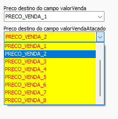

# Conversão Gestão Fácil  
## Informações  
- **Banco**  
    - Tipo: MySQL  
    - Versão Especifica: Utilizar mais recente  
  
## Configuração específica  
### Precificação  
No banco de origem existem 2 campos de preço:  
1) valorVenda  
2) valorVendaAtacado  
Defina para qual campo destino cada campo origem deve ser convertido  
