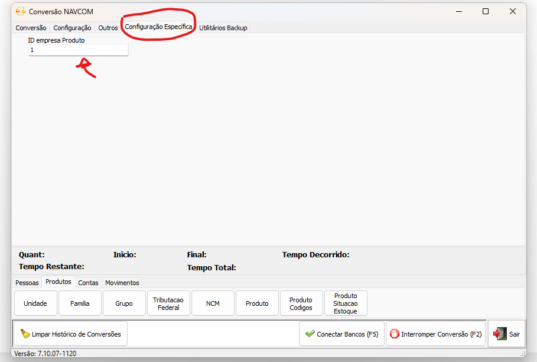

Voltar: [Conversão Especifica](ConfiguracaoEspecifica.md)
# Conversão NAVCOM

## Informações  
- **Banco**  
    - Tipo: Firebird 2.5  
     

### Abas implementadas

#### Legenda

| Ícone | Status                   |
|:-----:| ------------------------ |
|  ✅   | Implementado: Completo   |
|  ⚠️   | Implementado: Incompleto |
|  ❌   | Não implementado         |
  
#### Implementação NAVCOM

| Cadastro | Pessoas | Produtos | Contas | Movimentos | Objetos |
|:--------:|:-------:|:--------:|:------:|:----------:|:-------:|
|    ❌    |   ✅    |    ✅    |   ✅   |     ✅     |   ❌    |

## Configuração específica  

### Configuração de Produtos ID Empresa:  

Na tabela de produtos de origem existem mais de um ID empresa para os produtos. Determine através da configuração especifica, o ID de qual empresa irá converter os produtos
