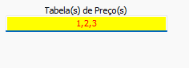

# Conversão Saga Gestor  
## Informações  
**Banco**  
- Tipo: Firebird  
- Versão Especifica: Versão 3.0  

### Abas implementadas

#### Legenda

| Ícone | Status                   |
|:-----:| ------------------------ |
|  ✅   | Implementado: Completo   |
|  ⚠️   | Implementado: Incompleto |
|  ❌   | Não implementado         |
  
#### Implementação

| Cadastro | Pessoas | Produtos | Contas | Movimentos | Objetos |
|:--------:|:-------:|:--------:|:------:|:----------:|:-------:|
|    ❌    |   ✅    |    ✅    |   ❌   |     ❌     |   ❌    |

Caso necessário abrir chamada para implementação de alguma entidade

## Configuração específica  

### Precificação  
Selecione quais tabelas de preço devem ser convertidas. Digite os IDs separados por virgula  

  

As tabelas podem ser verificadas na tabela origem `TABELA_PRECO_PRODUTOS`  
  
