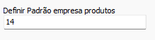
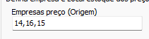
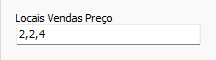
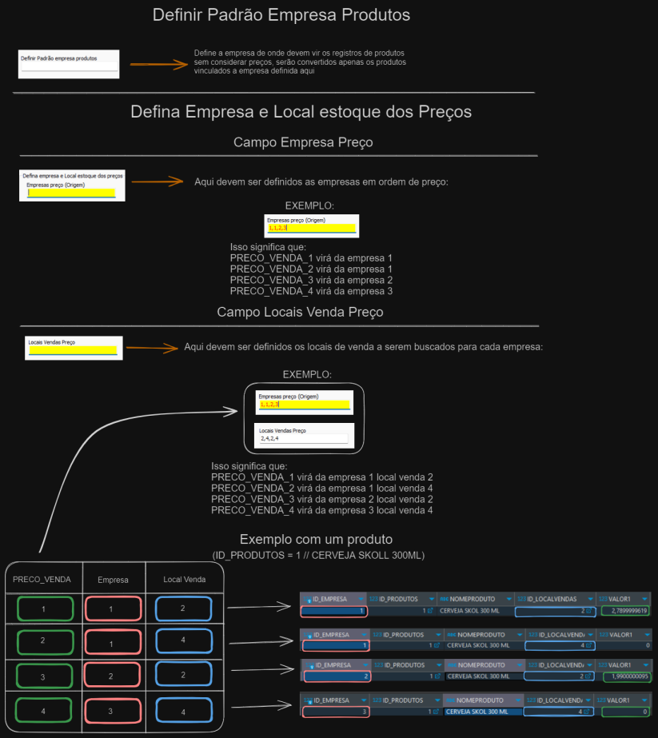

# Conversão XPert  
## Informações  
- **Banco**  
    - Tipo: SQL Server  
    - Versão Especifica: Utilizar mais recente  
## Configurações específicas  
### Precificação e Produtos  
No sistema XPert podem existir diversas empresas e os produtos são cadastrados por empresa, além disso cada produto pode ter diversos preços por empresa. Essa forma de precificação e cadastro de produtos é completamente incompatível com o SOL.NET atualmente, sendo assim algumas configurações são necessárias  
#### Definir padrão empresa produtos  
Define a empresa da qual devem ser convertidos os produtos (Sem considerar os preços). Defina apenas uma empresa  
  
### Defina empresa e local estoque dos preços  
1) Empresa preço(Origem)  
    - Define as empresas das quais devem ser buscados os preços em ordem de preço  
          
1) Locais vendas Preço  
    - Define os locais de venda a serem buscados para cada empresa  
          
>[!IMPORTANT]  
>O máximo de combinações Empresa/Locais Venda deve ser 8  
  
>[!NOTE]  
>O formulário conta com um botão de ajuda para auxiliar no processo de conversão de preços  
### Resumo  
A precificação do XPert pode ser um pouco confusa, verifique a baixo um fluxograma de explicação  
  
