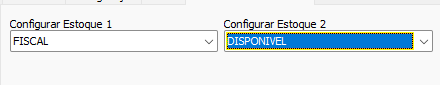

# Conversão Alpha Software  
## Informações  
- **Banco**  
    - Tipo: SQL Server  
    - Versão Especifica: 2000  
    - Obs: Converter para mais recente utilizando o SQL Server 2008 como ponte, se necessário  
  
## Configuração específica  
### Configuração de Situação estoque:  
  
Na tabela de estoque de origem existem os campos `Estoque1` e `Estoque2`. Determine através das caixas de seleção, para qual situação estoque cada campo origem deve ser convertido 