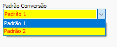

# Conversão Derevo Gestor  
## Informações  
- **Banco**  
    - Tipo: Firebird  
    - Versão Especifica: Versão 2.5  
  
## Configuração específica  
### Configuração de Padrão  
- Foi identificado que o sistema Derevo possui versões diferentes. O padrão deve ser selecionado na aba de configuração especifica  
 