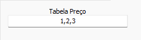

# Conversão MCN  
## Informações  
**Banco**  
- Tipo: Firebird  
- Versão Especifica: Versão 3.0  
## Configuração específica  
## Precificação  
Selecione quais tabelas de preço devem ser convertidas. Digite os IDs separados por virgula  
  
As tabelas podem ser verificadas na tabela origem `EST_PRODPRECOS`  
  
