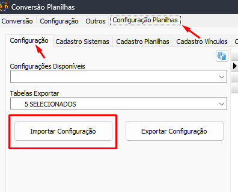
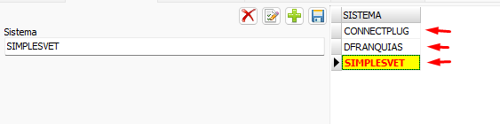
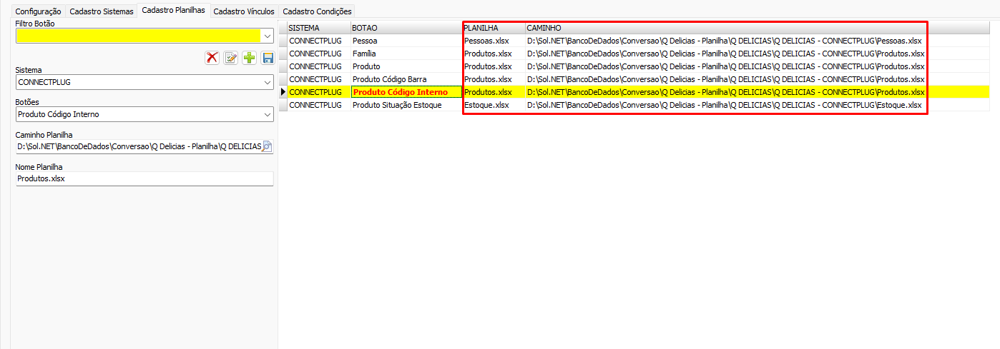
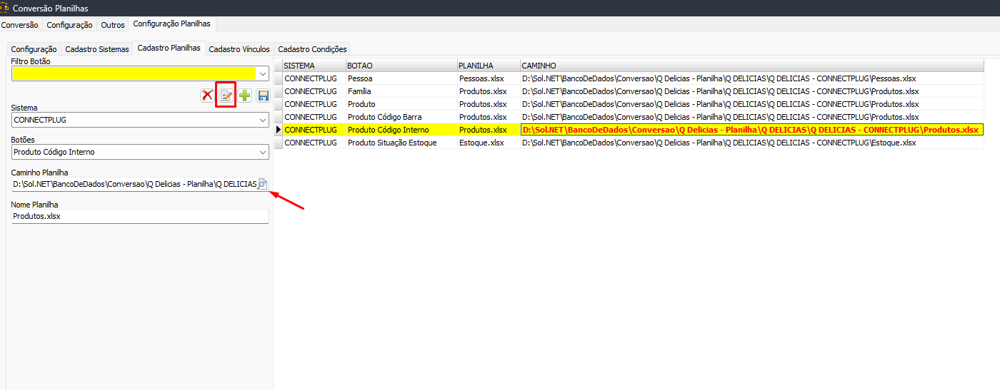

# Conversão Planilhas  
A Conversão de planilhas é bastante parecida com as conversões de banco de dados no que diz respeito a [configuração de conversão](./Convers%C3%A3o.md), com a diferença de que a conexão de banco origem não está disponível na aba de [conexão](./Conectar%20bancos.md). Além disso, os sistemas a ser convertidos são definidos através de um arquivo de configuração (Disponível no [mega](https://mega.nz/fm/d9x1QLTJ)). Os botões ficarão disponíveis de acordo com sistema selecionado.  
### Importando configurações  
Na aba `Configuração Planilhas->Configuração` clique no botão `Importar Configuração` e selecione o arquivo de configuração  
  
### Selecionando sistema  
Após a importação, na aba `Configuração Planilhas->Cadastro Sistemas` selecione o sistema  
  
### Abrindo as planilhas  
As planilhas devem ser apontadas na aba `Configuração Planilhas->Cadastro Planilhas`.  
  
Para editar apontar para as planilhas corretas veja o nome da planilha em cada registro, clique no botão 📝 ajuste o `Caminho Planilha` para o arquivo correto  
  
>[!IMPORTANT]  
>A conversão de planilhas só aceita arquivos .xlsx, se necessário converta as planilhas para esse formato  
  
