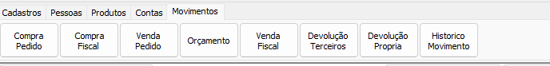
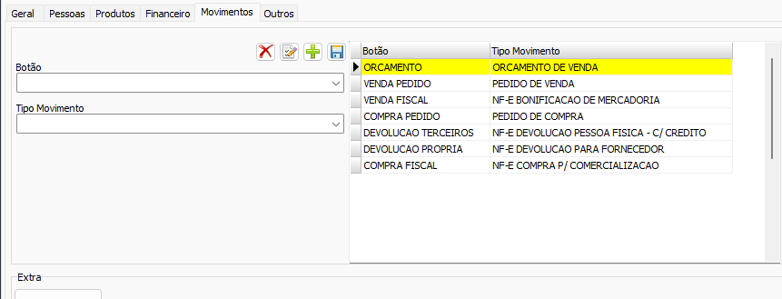
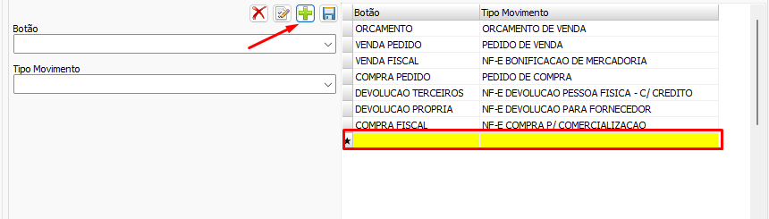
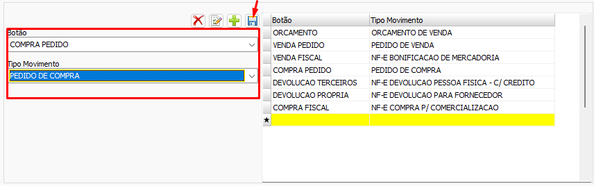

# Movimentos  
Aba de conversão de entidades relacionadas a Movimentos. É necessário realizar [Configuração de Data](./Configura%C3%A7%C3%A3o%20de%20Data.md) para determinar qual intervalo deve ser considerado ao converter movimentos, além disso é necessário configurar cada botão para um tipo de movimento antes de iniciar a conversão  
  
>[!IMPORTANT]  
>A conversão de movimentos lida com intervalos de tempo de até um ano, devido ao grande volume de registros que essas conversões tendem a lidar. Sendo assim é de **suma importância** que os registros já convertidos não sejam deletados antes de prosseguir para um próximo intervalo. Isso é possível clicando em "não" na confirmação de deleção de registros. Ver [Configuração de Data](./Configura%C3%A7%C3%A3o%20de%20Data.md) e [Confirmações](./Confirma%C3%A7%C3%B5es.md) para entender como facilitar esse processo  
  
## Configurando os botões  
Antes de iniciar a conversão é necessário associar um tipo de movimento ao botão a ser convertido. A aba de configuração pode ser encontrada em `Configurações->Movimentos`  
  
Para configurar um botão primeiro clique no item +  
  
Selecione o botão e o tipo de movimento e depois clique em salvar  
  
## Entidades Comuns  
- Todos botões (exceto Historico de movimento)  
    - Tabelas: `MOVIMENTOS`, `MOVIMENTOS_ITENS`, `RATEIO`  
    - Dependências:  
        - [Produtos](./Produtos.md)