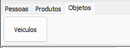
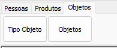

# Objetos  
Aba de conversão de entidades relacionadas a Objetos. Essa aba pode possuir duas formas:  
1) Objetos Específicos:  
  
Para casos onde os Objetos na origem são categorizados de maneira especifica  
2) Objetos Genéricos:  
     
Para casos onde os Objetos na origem são categorizados de maneira genérica  
## Entidades Comuns  
- Objetos  
    - Tabelas: `OBJETOS`, `TIPO_OBJETO`, `OBJETOS_COMPLEMENTO`  
    - Dependências  
        - [Pessoas](./Pessoas.md)  
        - `Tipo Objeto` no cenário 2  
## Ver também  
- [Pessoas](./Pessoas.md)