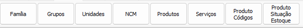
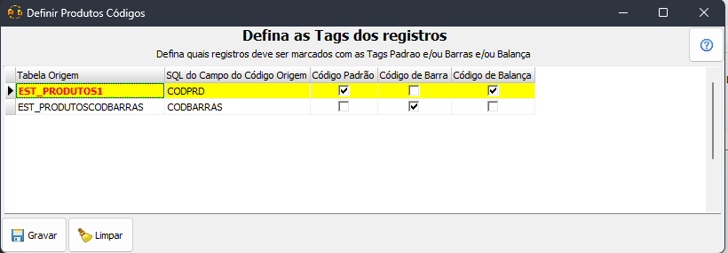

# Produtos  
Aba de conversão entidades relacionadas a produtos (`PRODUTOS`). Não há configuração de produtos a serem feitas, no entanto, é provável que a conversão contenha uma [Configuração Específica](ConfiguracaoEspecifica.md) para atribuir precificação, estoque e demais detalhes de produtos (Veja um exemplo em [Conversão XPert](ConversaoXPert.md))  
  
## Configuração de produtos códigos  
Ao clicar no botão `Produto códigos` uma tela de configuração de códigos será exibida  
  
 O proposito desta tela é dar flexibilidade a conversão, tornando possível escolher antes do processo de conversão para qual tipo de código os campos origem devem ser convertidos.  
 >[!NOTE]  
 >O código de balança **sempre** será validado pela conversão, sendo assim, não é necessário se preocupar quando os códigos de balança estiverem misturados com outros tipos de código no mesmo campo  
   
 >[!IMPORTANT]  
 >É **obrigatório** selecionar ao menos um campo como código padrão e um campo como código de barra.  
## Entidades comuns  
#### `Família`  
 - Tabela: `FAMILIA_PRODUTOS`  
 - Dependências: Sem Dependências  
#### `Grupos`  
- Tabela: `GRUPO_PRODUTOS`  
- Dependências  
    - [[#`Familia`|Família]]  
#### `SubGrupos`  
- Tabela: `SUB_GRUPO_PRODUTOS`  
- Dependências:  
    - [[#`Grupos`|Grupos]]  
#### `Unidades`  
- Sem Dependências  
#### `NCM`  
- Tabela: `NCM`  
- Dependências  
    - Se não houver `Tributação Federal`: Sem dependências  
    - Se houver `Tributação Federal`:   
    	- `Tributação Federal`  
#### `Produtos/Serviços`  
- Tabela: `PRODUTOS`  
- Dependências:  
    - Se Houver:  
    	- [[#`Família`|Família]]  
    	- [[#`Grupos`|Grupos]]  
    	- [[#`SubGrupos`|Sub Grupos]]  
    	- `Fornecedores/Pessoas`  
    - [[#`Unidades`|Unidades]]  
    - [[#`NCM`|NCM]]  
- Obs: Na maioria das vezes é necessário configurar a precificação na aba [Configuração Específica](ConfiguracaoEspecifica.md)  
#### `Produtos Codigos`  
- Tabela: `PRODUTO_CODIGOS`  
- Dependências:  
    - `Produtos/Serviços`
- Obs: Ver [Configuração de produtos códigos](Produtos.md#Configuração%20de%20produtos%20códigos)  
#### `Produto Situação Estoque`  
- Tabela: `PRODUTO_SITUACAO_ESTOQUE`  
- Dependências  
    - `Produtos/Serviços`  
    - Se houver:  
	- `Locais Estoque`