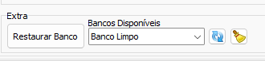

# Realizar Cópias após Conversão  
Marque para realizar uma cópia do banco de dados após o momento de conversão. Essas cópias podem ser restauradas futuramente através da sessão `Extras` na aba de [Configuração Geral](./Configura%C3%A7%C3%A3o%20Geral.md). Útil nos processos de reabertura de chamadas ou correções.  
