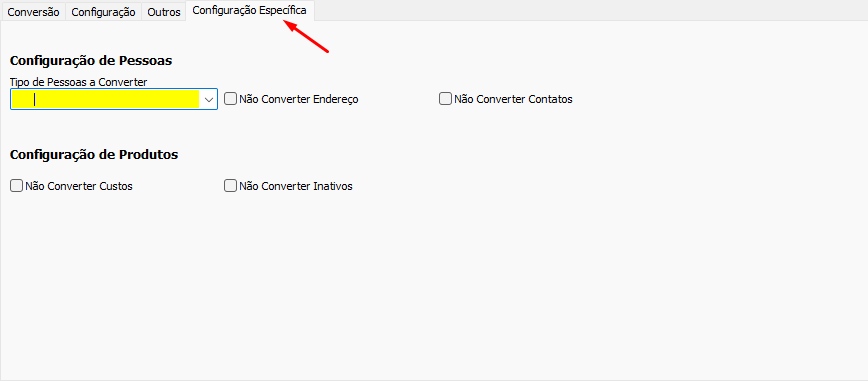
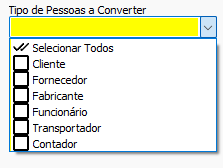
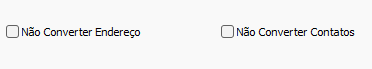
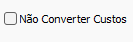
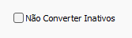

Voltar: [Conversão Especifica](ConfiguracaoEspecifica.md)
## Informações
- Banco: Bancos SOL.NET

## Sobre
O formulário `Troca CNPJ V2` é a atualização do formulário `Troca CNPJ` para molde de conversões padronizadas. Esse projeto é um trabalho em progresso, caso alguma conversão não esteja disponível abra uma chamada

### Conversões Disponíveis
- Legenda:
	- ✅ - Conversão implementada
	- ❌ - Conversão não implementada

#### Pessoas

| Conversão | Status | Obs. |
| --------- | ------ | ---- |
| Pessoas   | ✅     |      |

#### Produtos

| Conversão                | Status | Obs.                  |
| ------------------------ | ------ | --------------------- |
| Familia                  | ✅     |                       |
| Grupo                    | ✅     |                       |
| Subgrupo                 | ✅     |                       |
| Marcas/Fornecedores      | ✅     | Movido para `Pessoas` |
| Unidade                  | ✅     |                       |
| Tributação               | ✅     |                       |
| CFOP                     | ❌     |                       |
| NCM                      | ✅     |                       |
| Grades                   | ❌     |                       |
| Produtos                 | ✅     |                       |
| Local Estoque            | ❌     |                       |
| Produto Situação Estoque | ❌     |                       |
| Imagens                  | ❌     |                       |
| Produtos Códigos         | ✅     | Novo                  | 

#### Contas

| Conversão      | Status | Obs. |
| -------------- | ------ | ---- |
| Contas Pagar   | ❌     |      |
| Contas Receber | ❌     |      |

#### Movimentações

| Conversão            | Status | Obs. |
| -------------------- | ------ | ---- |
| Tipo Movimento       | ❌     |      |
| Movimentos           | ❌     |      |
| Historico Movimentos | ❌     |      |

## Configurações Específicas

### Configurações de `Pessoas`

#### Tipo de Pessoas a converter
Determina quais tipos de pessoa serão convertidas

  

#### Não Converter endereço e Não converter contatos

Se marcados não converte Endereços e/ou Contatos durante a conversão de pessoas

### Configuração de `Produtos`
#### Não Converter Custos

Se marcado não busca os custos dos produtos ao converter `Produtos`
#### Não Converter Inativos

Não converte produtos inativos (`INATIVO = 1`). Útil em cenários onde o banco é muito grande

